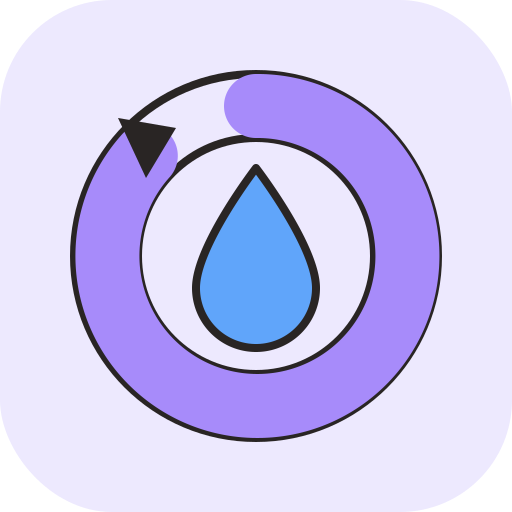
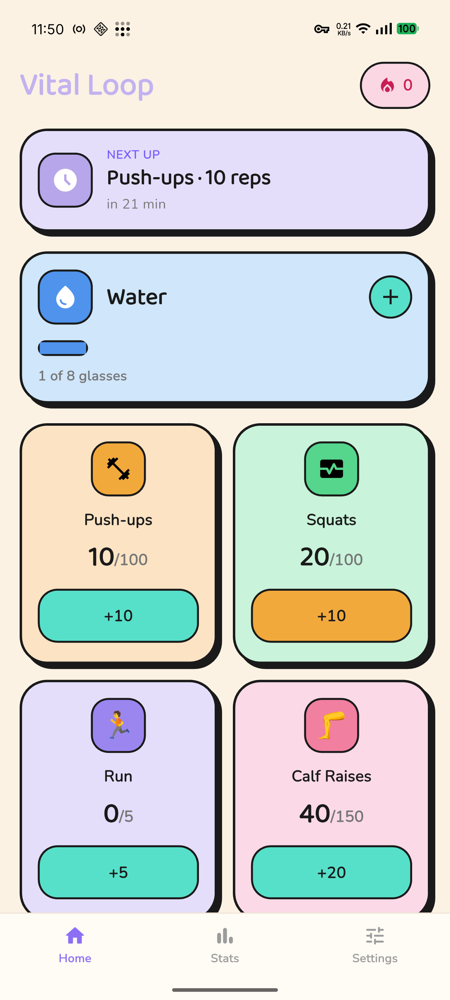
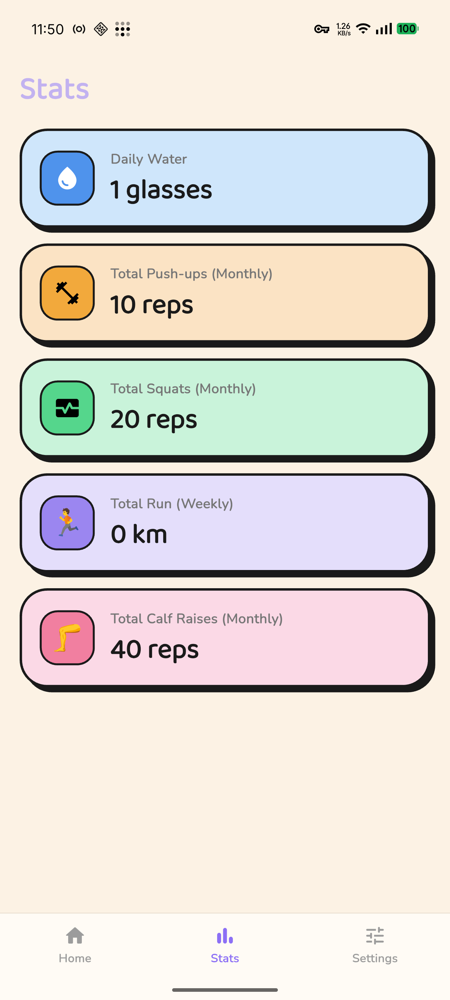
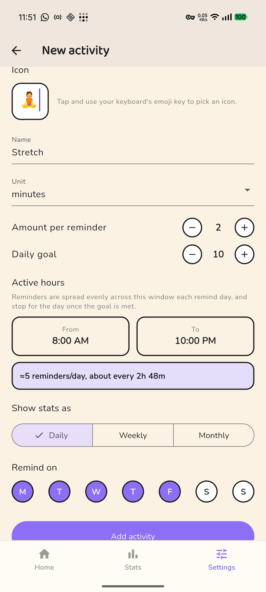

<div align="center">
  

  # Vital Loop

  A no-nonsense Android reminder app for the small health habits that are
  easy to forget during the day — drink water, do a set of push-ups, take a
  walk — with reminders that adapt to your actual progress instead of
  nagging you after you're already done.
</div>

## Screenshots

| Home | Stats | Add activity |
|---|---|---|
|  |  |  |

## Features

- **Automatic reminder scheduling.** You don't pick "remind me every N
  hours" — you set a daily goal, an amount per reminder, and an active-hours
  window (e.g. 8 AM–5 PM), and Vital Loop works out how many reminders are
  needed and spaces them evenly across the window. Set a goal of 100 at 10
  per reminder and it schedules 10 reminders across your window automatically.
- **Reminders stop once you're done.** Hit your daily goal early and every
  remaining reminder for that activity is cancelled for the rest of the day
  — no more nagging after the fact.
- **Office day toggle.** A one-tap switch that mutes every reminder and
  excludes the day from your stats and streak. Turns itself back off the
  next day automatically, so you never have to remember to re-enable it.
- **On trip toggle.** Works the same as Office day, but for however many
  days you need — it stays on until you switch it off yourself, covering
  multi-day trips without breaking your streak.
- **Real stats, not projections.** Weekly and Monthly totals on the Stats
  page are actual sums of what you logged each day, not a computed target —
  Office day / On trip days are excluded from those sums entirely.
- **Streak tracking.** A running count of consecutive days every activity's
  daily goal was fully met, shown right on Home.
- **Flexible per-activity setup.** Each activity gets its own icon (typed
  via your device's own emoji keyboard — no in-app picker to outgrow), name,
  unit (a predefined dropdown: reps, glasses, ml, cups, minutes, hours,
  steps, km, sets, pages, times), per-reminder amount, daily goal, active
  hours, which days of the week it reminds on, and which stats period
  (Daily/Weekly/Monthly) it features.
- **Three activities included out of the box** (Water, Push-ups, Squats) —
  fully editable or deletable like anything you add yourself.
- **Offline-first.** Everything is stored locally on-device (Hive); no
  account, no network dependency, no cloud sync.

## Tech stack

- [Flutter](https://flutter.dev) (Android)
- [flutter_riverpod](https://pub.dev/packages/flutter_riverpod) for state management
- [go_router](https://pub.dev/packages/go_router) for navigation
- [Hive](https://pub.dev/packages/hive) for local, offline-first storage
- [flutter_local_notifications](https://pub.dev/packages/flutter_local_notifications) for scheduled reminders
- [google_fonts](https://pub.dev/packages/google_fonts) (Baloo 2 + Nunito)

## Getting started

```bash
flutter pub get
flutter run
```

### Building an APK

```bash
# Debug build, for quick sideload testing
flutter build apk --debug

# Release build (see android/key.properties.example if signing your own release)
flutter build apk --release
```

## Project structure

```
lib/
  core/            # Theme, shared widgets, notifications, settings, storage
  features/
    activities/    # Activity domain model, Hive repository, Riverpod providers
    home/          # Home screen and its cards/banners
    stats/         # Stats screen
    settings/      # Settings screen, add/edit activity form
    shell/         # Bottom navigation shell
```

## Support

If Vital Loop is useful to you, you can support its development on Ko-fi:
[ko-fi.com/crystaxit](https://ko-fi.com/crystaxit).

## License

MIT — see [LICENSE](LICENSE).
